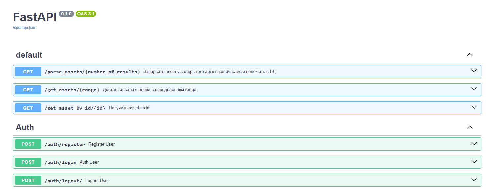

### Навигация:
```
/src/auth - все связанное с авторизацией
```
```
/src/data - конфиг и схемы
```
```
/src/database - немного базы данных
```
```
/src/scrapers - selenium и API парсеры
```

#### *_Как основной я решил выбрать вариант с парсингом по API_*
#### PS: Миграции оставил для удобства развертывания. Также нужно будет установить _*chrome_driver*_ и *_chrome_* бинарники в директорию *_/src/scrapers/selenium_scrape_* под соответствующими названиями

## Иллюстрация endpoints
<picture>
  <source media="(prefers-color-scheme: dark)" srcset="./rest_images/api_screenshot.png">
  
</picture>